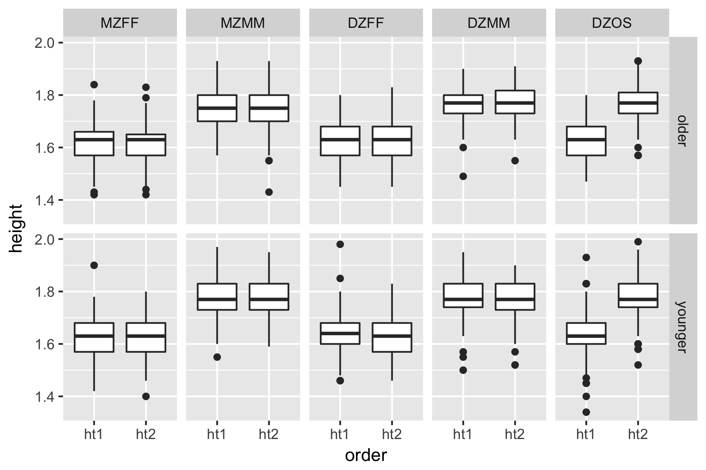

```{r setup, include=FALSE}
knitr::opts_chunk$set(echo = TRUE, eval = TRUE, warning = FALSE, fig.width=6, fig.height=4, out.width = "70%", fig.align = "center") 
```
 
## Introduction

In this lab, you will use the `broom` package, by David Robinson, to turn results of many statistical analyses into tidy data. 

## Australian twin sample biometric data

In this lab, we explore `twinData`, Australian twin data with 3808 observations on the 12 variables including body mass index (BMI) assessed in both MZ (identical) and DZ (fraternal) twins. 


```{r, message = FALSE}
library(tidyr)
library(dplyr)

#install.packages("OpenMx")
library(OpenMx)
data(twinData)
twinData <- as_tibble(twinData)
```

Type `help(twinData)` to understand the data set. The data table `twinData` appears to be tidy (*for some purposes*). Check that each column is a variable, and each row is an observation. Note that the unit of observation is not a person, but a family. 

Suppose that we want to answer some questions: 

1. Are the twins similar in height, weight and bmi? 
2. Are the first-born taller than the second-born? 

There are many other interesting questions you may pose, but let us focus on these two simple questions. 

To answer the first question, we need to carefully reformuate the question. What does it mean that the twins' heights are similar? 
Does it mean that if you know the older twin's height, you can well predict the younger twin's height? 

## Exercise 

1. In terms of the relation between two variables, `ht1` and `ht2`,  what does high similarity of heights imply? 

2. Using ggplot2, we can create a scatter plot to visually investigate the relation between `ht1` and `ht2`. The scatter plot gives some impression on the answer of the question, "yes". Why? 

```{r}
library(ggplot2)
twinData %>% ggplot(mapping = aes(ht1, ht2)) + 
  geom_point() 
```


3.  Will the answer be the same if we use more information? Consider two more variables `cohort`, `zygosity`. Add more layers or use facet to include the information contained in these two variables. 
 

4. Inspect the scatter plot(s) you created. What do you see? 


To quantify your observation, we may test whether the correlation coefficient between the two variables, `ht1` and `ht2`, is greater than 50%. A statistical test to test whether the two variables, `ht1` and `ht2`, are correlated: 

```{r}
twinData %>% 
  with(cor.test(~ ht1 + ht2, alternative = "greater"))
```
See that 95 percent confidence interval is [0.6023115, 1], which does not include the prespecified 50%. If we make a conclusion that the true correlation coefficient is greater than 50%, then we are wrong for less than 5 percent of the time. 

To repeat the test for each subgroup (defined by the values of `cohort` and `zygosity`), it is natural to use `group_by`. However, naively trying the following does not work: 

```
twinData %>% 
   group_by(cohort,zygosity) %>% 
   summarze(cor.test(~ ht1 + ht2, data = .))
```

This is because the result of the function call `cor.test(~ ht1 + ht2, data = .)` is not a data frame, and is not tidy. 

## Combine results from multiple analyses using `broom`

This is where we need an additional package, called `broom`, to help make the result of `cor.test()` tidy. We use the function `broom::tidy()`. Try the following. 

```{r}
library(broom)
cor_result <- cor.test(~ ht1 + ht2, data = twinData)
tidy_cor_result <- tidy(cor_result)
```

See that `cor_result` is a list, not a data frame, but `tidy_cor_result` is a data frame. 

```{r}
str(cor_result)
```

```{r}
str(tidy_cor_result)
```

We are almost there, but not quite yet. Notice that trying the following does not work. Why? 

```
twinData %>% 
  group_by(cohort,zygosity) %>%  
  summarize(tidy( cor.test(~ ht1 + ht2, alternative = "greater" , data = . )))

```
The problem is that the arguments of the function `summarize()` must be 	  of the form `var = value`. To get around this issue, we use `dplyr::do()`. `do()` means "Do anything". This is a general purpose complement to the specialised manipulation functions `filter()`, `select()`, `mutate()`, `summarise()` and `arrange()`. You can use `do()` to perform arbitrary computation, returning either a data frame or arbitrary objects which will be stored in a list. This is particularly useful when working with models: you can fit models per group with `do()` and then flexibly extract components with either another `do()` or `summarise()`.

```{r}
twinData %>% 
  group_by(cohort,zygosity) %>%  
  do(tidy( cor.test(~ ht1 + ht2, alternative = "greater" , data = . )))
```

## Exercises

5. sort the result of above computation from the largest estimate of correlation coefficient to the smallest. 

6. Create a new variable to indicate whether the correlation coefficient between `ht1` and `ht2` in the particular subgroup is greater 0.5, with 95 percent confidence. Save the resulting data frame by the name `sig_twin_cor`.
 
7. List the only the combinations of `cohort` and `zygosity` where the twins' heights are significantly *similar*. Here the similarity is defined by the test result, evaluated in #6. 
 


## Exercises (homework)

8. Repeat exercise #3. This time, use the variables `cohort`, `zygosity` to facet, and use different colors to indicate the subgroups for which the heights are significantly similar. Comment on your finding. 
 

9. Repeat exercise #8, but compare weight this time. You should be able to recycle almost all code chunks. 

The following set of exercises is to answer the second question "Are the first-born taller than the second-born?" for each group given by the values of `cohort` and  `zygosity`. We will use the paired t-test. You may want to go back to your Intro Stat textbook to learn about the paired t-test. 

10. Recreate the following graphic. This involves transforming `twinData` into a narrow form using `gather()`. You might want to take a look at Lecture 7 note for boxplots.
 



11. Inspect the data graphic. Is there any need to adjust the hypothesis (posed in Question #2)? 

12. Use the paired t-test to test whether the first-born's height is significantly different from the second-born for each subgroup. 

    + Why do we use the paired t-test, as opposed to using the two-sample t-test?
    + Test whether there is a difference with significance level 5%, for each subgroup.
    + Finally, recreate the above graphic with different colors indicating the results of t-tests. 

The following piece of code might be useful. 
```
twinData %>% 
  with(t.test(.$ht1, .$ht2, paired = TRUE))
```

 

